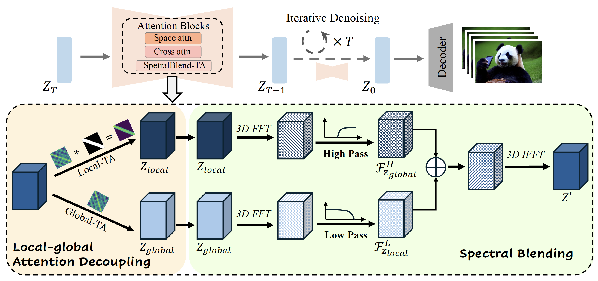

# FreeLong : Training-Free Long Video Generation with SpectralBlend Temporal Attention (2024 NIPS)

[](https://arxiv.org/pdf/2407.19918)
[](https://yulu.net.cn/freelong/)
<!-- [](https://huggingface.co/spaces/Simase/FreeLong) -->

This repository is the official implementation of [FreeLong](https://arxiv.org/pdf/2407.19918).

FreeLong can generate **512-frame** long videos with high consistency and fidelity **without the need for additional training**.


[Yu Lu](https://yulu.net.cn/), [Yuanzhi Liang](https://akira-l.github.io/), [Linchao Zhu](https://ffmpbgrnn.github.io/) and [Yi Yang](https://scholar.google.com/citations?user=RMSuNFwAAAAJ&hl=en)

<div>
    <h4 align="center">
        
    </h4>
</div>


## :open_book: Overview


We propose **FreeLong**, a straightforward and training-free approach  to extend an existing short video diffusion model for consistent long video generation.


## :fire: Updates
- [10/2024] We release the code of FreeLong implementation on LaVie and VideoCrafter2
- [9/2024] FreeLong is accepted by NIPS 2024.
- [6/2024] [Project page](https://yulu.net.cn/freelong/) and [paper](https://arxiv.org/pdf/2407.19918) available.

## :page_with_curl: Usage
In this repository, we utilize [LaVie](https://github.com/Vchitect/LaVie) as a case study to illustrate the integration of FreeLong into existing text-to-video inference pipelines.

Within the file [`attention.py`](examples/LaVie/freelong/models/attention.py), we define the `freelong_temp_attn` function inside the `BasicTransformerBlock` class. This function is responsible for executing two-stream attention and merging both global and local features.

Additionally, in [`freelong_utils.py`](examples/LaVie/freelong/models/freelong_utils.py), we provide the necessary code for frequency filtering and mixing.

For guidance on incorporating FreeLong into other video diffusion models, please refer to the aforementioned scripts.


## :hammer: Quick Start

### 1. Clone Repo

```
git clone https://github.com/aniki-ly/FreeLong
cd FreeLong
cd examples/LaVie
```

### 2. Prepare Environment

```
conda env create -f environment.yml
conda activate lavie
```

### 3. Download Checkpoints
Download pre-trained [LaVie models](https://huggingface.co/YaohuiW/LaVie/tree/main), [Stable Diffusion 1.4](https://huggingface.co/CompVis/stable-diffusion-v1-4/tree/main), [stable-diffusion-x4-upscaler](https://huggingface.co/stabilityai/stable-diffusion-x4-upscaler/tree/main) to `./pretrained_models`. You should be able to see the following:
```
├── pretrained_models
│   ├── lavie_base.pt
│   ├── lavie_interpolation.pt
│   ├── lavie_vsr.pt
│   ├── stable-diffusion-v1-4
│   │   ├── ...
└── └── stable-diffusion-x4-upscaler
        ├── ...
```

### 4. Inference with FreeLong
After downloading the base model, run the following command to generate long videos with FreeLong. The generation results is then saved to `res` folder.
```
cd freelong
python pipelines/sample.py --config configs/sample_freelong.yaml
```
where `video_length` in the config can be used to control the generated length of long video, which default set to 128. Modify this parameters should also modify the length local_masks length in [attention.py](examples/LaVie/freelong/models/attention.py)

You can change the text prompts in the config file. To tune the frequency filter parameters for better results

## :framed_picture: Generation Results

Please refer to our [project page](https://yulu.net.cn/freelong/) for more visual comparisons.


## Acknowledgements
The code is built upon [LaVie](https://github.com/Vchitect/LaVie) and [VideoCrafter2](https://github.com/AILab-CVC/VideoCrafter), with additional references to code from [FreeInit](https://github.com/TianxingWu/FreeInit) and [FreeNoise](https://github.com/AILab-CVC/FreeNoise). We thank all the contributors for their efforts in open-sourcing these projects.

## :fountain_pen: Citation

   If you find our repo useful for your research, please consider citing our paper:

   ```bibtex
@article{lu2024freelong,
  title={Freelong: Training-free long video generation with spectralblend temporal attention},
  author={Lu, Yu and Liang, Yuanzhi and Zhu, Linchao and Yang, Yi},
  journal={arXiv preprint arXiv:2407.19918},
  year={2024}
}
   ```
